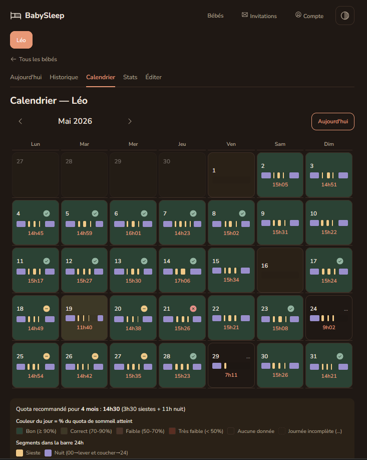
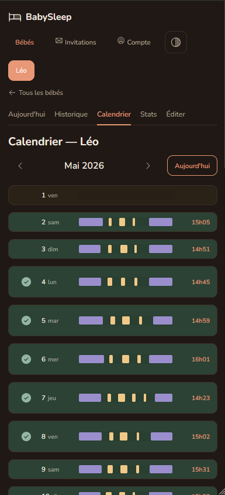
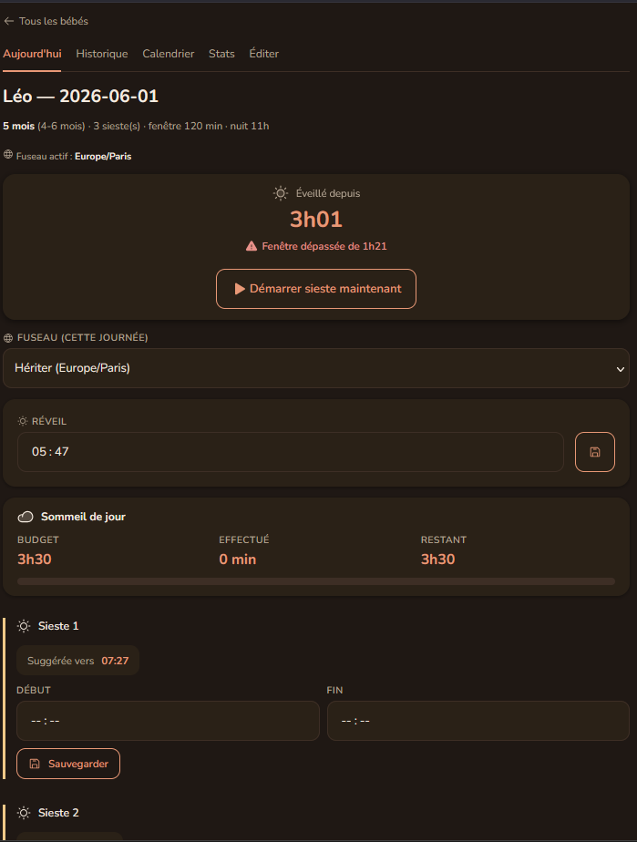
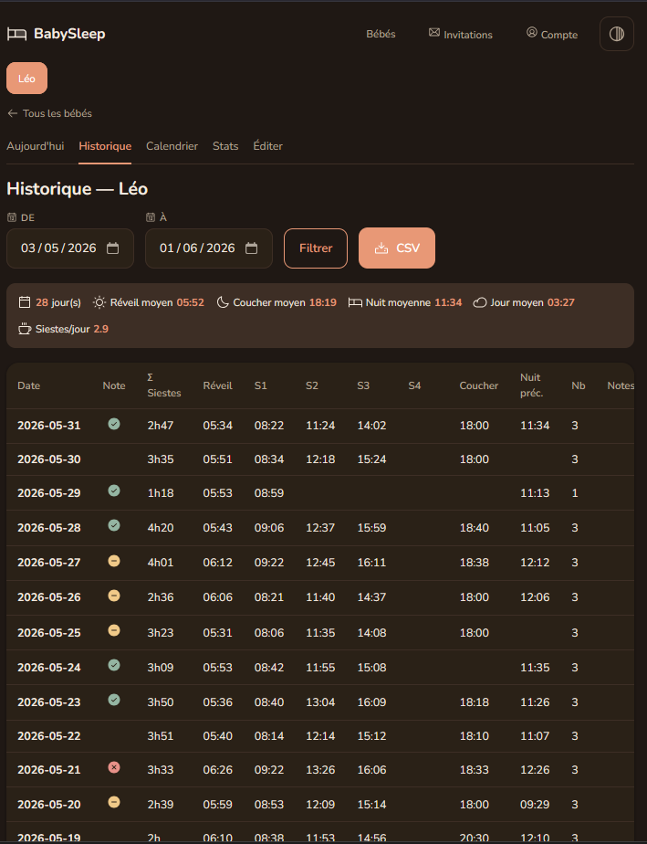
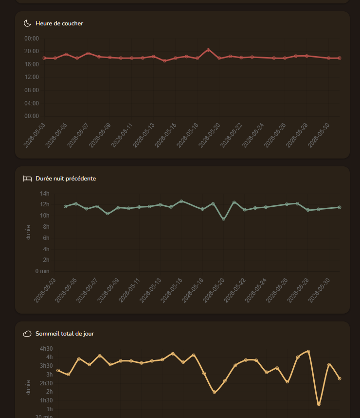

# BabySleep

A self-hosted PWA for tracking your baby's sleep, naps, and night-time patterns.
Built for parents who want to keep their family data on their own server.

🇫🇷 [Readme en français](./README.md)



---

## What is this?

BabySleep is a small web app you run on your own machine (Raspberry Pi, NAS,
VPS, laptop — whatever runs Docker). It helps you:

- Log your baby's wake time, naps, and bedtime
- See an age-appropriate suggestion for the next nap and tonight's bedtime
- Track progress over weeks with a calendar heatmap and a stats page
- Rate each night manually (good / so-so / rough) for at-a-glance review later
- Share access with a partner via private invitations

No cloud, no analytics, no account on someone else's server. Your data lives in
a single SQLite file on a Docker volume you control.

---

## Features

- **Today view** — quick form for today's wake / nap / bedtime entries with a
  live "wake-window" timer so you know when the next nap is due.
- **Calendar** — month grid (or vertical strip on mobile) with a 24h timeline
  per day, heatmap colours based on % of age-recommended total sleep, and a
  manual rating per night (✓ / − / ✗).
- **History** — filterable table with CSV export.
- **Stats** — charts of averages over the period (wake time, bedtime, nap
  durations).
- **Multi-baby** — track several babies under the same account.
- **Multi-user** — admin generates time-limited invitation links; password-based
  auth with argon2id hashing.
- **PWA** — installable from the browser; iOS standalone-capable with the
  proper apple-touch-icon and metas.
- **Timezone-aware** — per-user, per-baby, and per-entry overrides.
- **Simple schema** — straightforward CSV import if you're migrating from
  another tracker.

Bilingual UI (FR / EN), auto-detected from the browser's Accept-Language
header at first login, switchable from the header (🌐) or /account.

---

## Screenshots

<table>
  <tr>
    <td width="50%"></td>
    <td width="50%"></td>
  </tr>
  <tr>
    <td align="center"><sub>Calendar (mobile)</sub></td>
    <td align="center"><sub>Today page with live wake-window timer</sub></td>
  </tr>
  <tr>
    <td></td>
    <td></td>
  </tr>
  <tr>
    <td align="center"><sub>History table</sub></td>
    <td align="center"><sub>Stats over a date range</sub></td>
  </tr>
</table>

---

## Quick start (Docker)

You need Docker and Docker Compose v2.

```bash
git clone https://github.com/Gavark/babysleep.git
cd babysleep
cp .env.example .env
# .env.example works as-is for a first test; re-read it to customise TZ,
# ORIGIN, or to opt into the scripted-admin setup.
docker compose up -d
```

Open <http://localhost:3000> in your browser — you'll be sent to a setup wizard
to create your admin account. After that, log in and start tracking.

### Behind a reverse proxy with HTTPS

If you want HTTPS via Let's Encrypt and a domain, the project ships a full
stack with Caddy + a nightly SQLite backup sidecar:

```bash
cp Caddyfile.example Caddyfile
# Edit Caddyfile and set your domain (DNS A/AAAA records must point at this host)
docker compose -f docker-compose.full.yml up -d
```

If you prefer Nginx Proxy Manager, Traefik, or your own reverse proxy, stick
with the minimal `docker-compose.yml` and point your proxy at port 3000.

---

## Configuration

All configuration is environment variables. See [`.env.example`](./.env.example)
for the full annotated list. Highlights:

| Variable | Required | Description |
|---|---|---|
| `ADMIN_EMAIL`, `ADMIN_PASSWORD` | no | Skip the setup wizard for scripted deployments. |
| `DISABLE_SIGNUP` | no | `true` to block `/signup` entirely. Invitations still work. |
| `ORIGIN` | yes if behind a proxy | Public HTTPS URL for CSRF/Origin checks. |
| `TZ` | no | Container timezone. Default `Europe/Paris`. |

Sessions are secured by 256-bit random IDs stored in `HttpOnly` + `Secure` +
`SameSite=Lax` cookies and validated against the database on every request —
there is no "session secret" to manage.

---

## Backup

`docker-compose.full.yml` ships a backup sidecar that copies the SQLite DB
into `./backups/` every night at 03:00 (configurable via `BACKUP_SCHEDULE`).
Retention defaults to 30 daily snapshots (`BACKUP_RETENTION`).

To trigger a backup on demand:

```bash
docker compose -f docker-compose.full.yml exec backup sh /usr/local/bin/run-backup
```

If you use the minimal compose, bring your own backup tooling (restic, borg, …)
pointed at the `babysleep_data` Docker volume.

---

## Upgrade

```bash
git pull
docker compose -f docker-compose.full.yml pull app
docker compose -f docker-compose.full.yml up -d app
```

The app applies pending Drizzle migrations at startup. Migrations to date are
additive only (no drops, no destructive changes) — your data is safe across
versions during `v0.x`.

---

## Reset your password

```bash
docker compose exec app npm run reset-password -- your@email
```

You'll be prompted for a new password.

---

## Development

```bash
npm install
cp .env.example .env
mkdir -p data
npm run db:migrate
npm run dev
```

Run the test suite:

```bash
npm test
```

Type-check:

```bash
npm run check
```

Stack: SvelteKit 2 + Svelte 5 (runes) + TypeScript strict, Drizzle ORM over
better-sqlite3, argon2id via `@node-rs/argon2`, Chart.js for stats,
phosphor-svelte for icons, Nunito Variable (self-hosted) for typography.

---

## Status & roadmap

This is `v0.x` — the data model and config surface may break between minor
versions. The schema is small (`users`, `babies`, `sleep_entries`, `sessions`,
`invitations`) and migrations are additive, but I'm not committing to API
stability until `v1.0`.

Things I want to add (no firm ETA):

- Web Push notifications when the wake window is over
- "Share with co-parent" with read-only / read-write distinction
- Optional tags per day (sick, daycare, vacation)

---

## License

[AGPL-3.0-or-later](./LICENSE). If you run a modified copy as a public service,
you must publish your modifications under the same license.

---

## Author

Built by [@Gavark](https://github.com/Gavark). Issues and PRs welcome.
